<<<<<<< HEAD
**TalentFinder** is an application designed to match project managers (Finders) and auditioners (Creators). These roles are not mutually exclusive, meaning users can decide 
to create projects or join them. Users will either login or register at the start of the app and then navigate to the Home screen, where they can view a list of projects to 
participate in or create a project. This application will use the Facebook SDK to allow users to connect their Facebook profiles to their application profiles.

Created by: Nicholas Powell
=======
Original App Design Project - Nicholas Powell
===

# TalentFinder

## Table of Contents
1. [Overview](#Overview)
1. [Product Spec](#Product-Spec)
1. [Wireframes](#Wireframes)
2. [Schema](#Schema)

## Overview
### Description
TalentFinder is an application designed to match project managers (Finders) and auditioners (Creators). These roles are not mutually exclusive, meaning users can decide to create projects or join them. Users will either login or register at the start of the app and then navigate to the Home screen, where they can view a list of projects to participate in or create a project. This application will use the Facebook SDK to allow users to connect their Facebook profiles to their application profiles.

### App Evaluation
- **Category:** Social Networking, Business
- **Mobile:** Quick and easy way to upload media to audition for roles, on the go project updates and connection with other users.
- **Story:** Finding talent work is immensely important for both Creators and Finders, so providing a quicker and easier process will be very valuable to all users.
- **Market:** User base is similar to that of Fiverr when including amateur talent. Includes different types of talent: (voice acting, guitar, singing, etc.) Demo will not include actual users, only mock users.
- **Habit:** Not habit forming, app use should be on a need be basis.
- **Scope:** Technically challenging considering I am planning to create a database and parse info to and from it. Lots of different views are involved, user tags, project tags, etc. for matching Creator and Finder users.

## Product Spec

### 1. User Stories (Required and Optional)

**Required Must-have Stories**

* User can create a new account
* User can login
* User can use camera to post profile picture photo
* User can connect to Facebook (uses Facebook SDK)
* Users can direct message each other
* Finder user can post new project
* Creator user can post media files to database for Finder user project to recieve
* Users can see feed of available projects
* User can use tags to filter projects/users

**Optional Nice-to-have Stories**

* User can view other user's profiles and view projects they are a part of
* User can follow certain projects (video games, animation, etc.)
* Finder user can post project updates
* Users can see notifications on project updates (auditioners send audio, projecter managers send updates)
* Finder user can see feed of users

### 2. Screen Archetypes and Specific Screens

* Login
   * User can login
* Registration
   * User can create a new account
* Profile 
    * User can view own profile or other profiles
    * User can add profile photo using camera functionality
    * User can make connection to Facebook
* Detail (Project)
    * User can see a more detailed view of project
* Stream (Project Feed)
    * User can view a feed of projects or users
* Messaging (Direct Messages)
    * User can access direct messages to other users 
* Messaging (Start Discussion)
    * User can create message for another user
* Messaging (Discussion)
    * User can open discussion already started with other user
* Creation (Finder)
    * User can create a new project attached
* Creation (Creator)
    * User can create audition for specified project
* Search
    * User can search for certain projects or users

### 3. Navigation

**Tab Navigation** (Tab to Screen)

* Home Tab
    * Project Feed
* Messages Tab
    * Direct Messages
* Create Tab
    * Creation (Finder)
* Search Tab
    * Search

**Flow Navigation** (Screen to Screen)

* Login
   * Project Feed
* Registration
   * Project Feed
* Profile
    * Start Discussion
    * Project
    * **BACK**
* Project
    * Start Discussion
    * Profile
    * Creation (Creator)
    * **BACK**
* Project Feed
    * Profile
    * Project
    * **BACK**
* Direct Messages
    * Discussion
    * **BACK**
* Start Discussion
    * Discussion
    * **BACK**
* Discussion
    * **BACK**
* Creation (Finder)
    * Project Feed (After Project Creation)
* Creation (Creator)
    * Project (After Audition Creation)
* Search
    * Profile
    * Project
    * **BACK**

# **END UNTIL UNIT 9**

## Wireframes

### Login

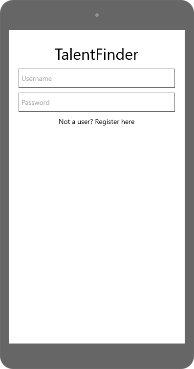

### Register

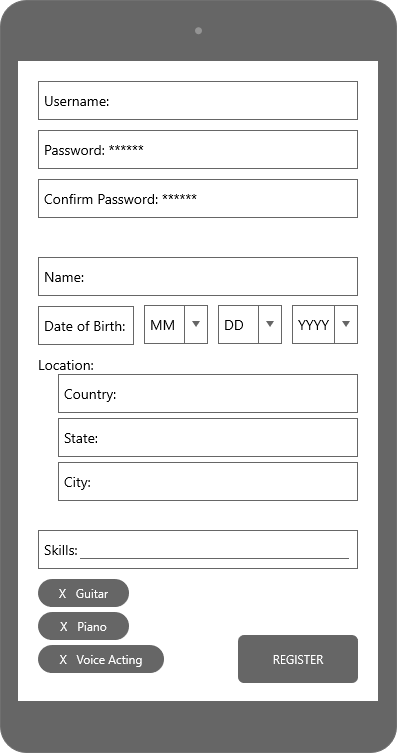

### Home Feed

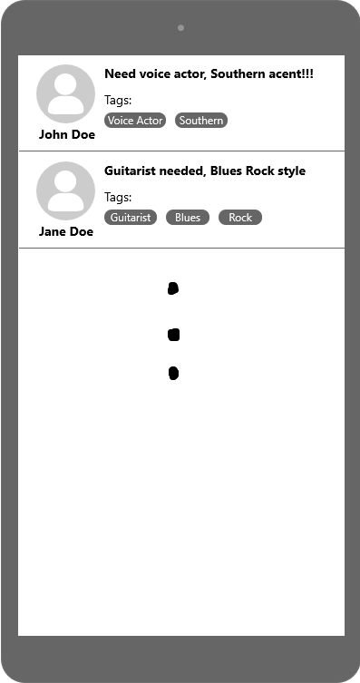

### Profile

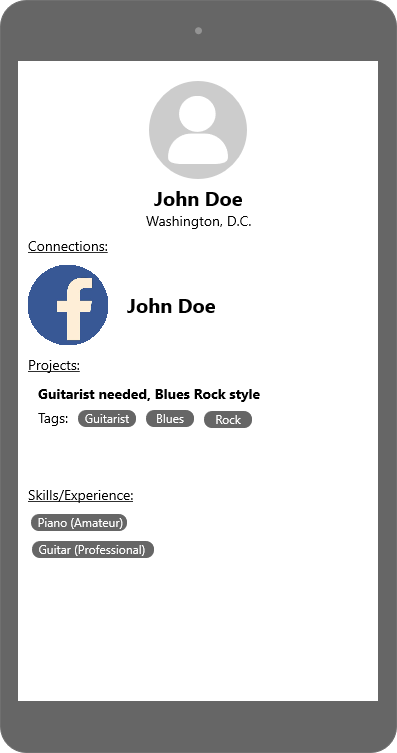

### Project

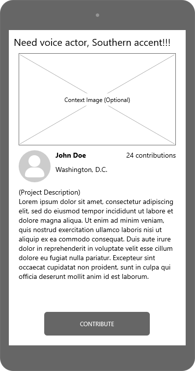

### Create

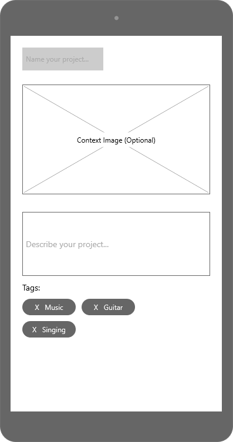

### Contribute

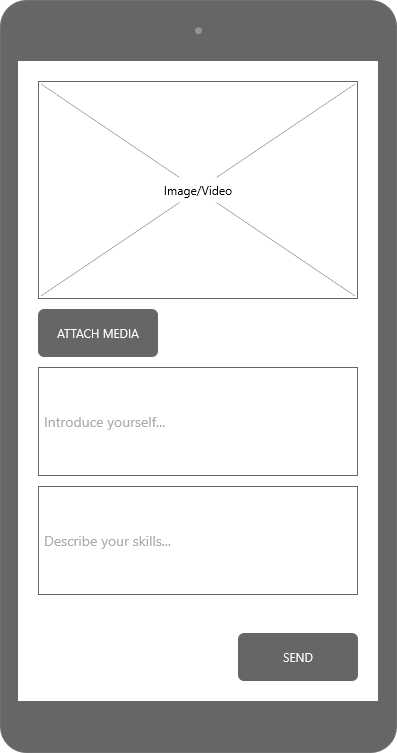

### Direct Messages

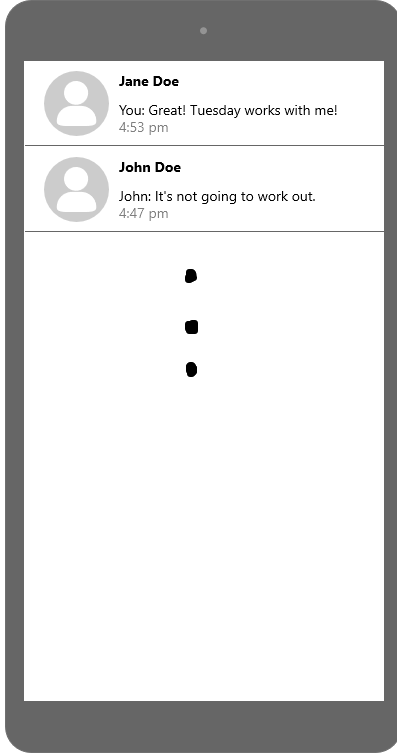

### Start Discussion

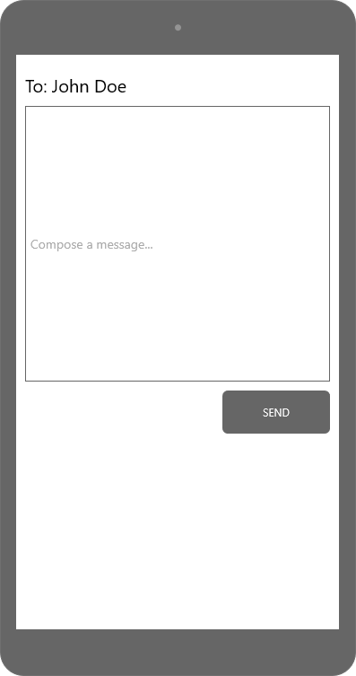

### Discussion

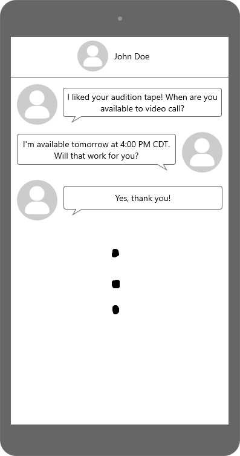

### Search

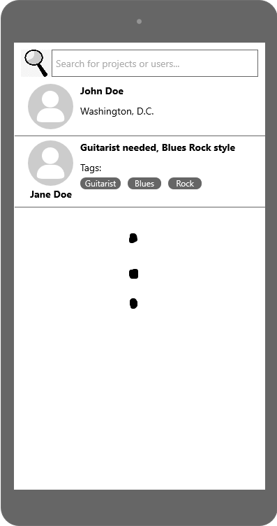

## Schema 

### Models

#### Project

| Variable Name | Type | Description |
| -------- | -------- | -------- |
| user | Pointer<User> | project author |
| title | String | project title |
| image | File | optional context image file |
| contributionCount | Number | number of project contributions |
| tags | List<String> | tags specified by project creator |
| description | String | project description |

#### Contribution

| Variable Name | Type | Description |
| -------- | -------- | -------- |
| media | File | media attached for contribution (.mp4, .jpg, .wav, etc) |
| userDescription | String | description of user |
| skillsDescription | String | description of user skills |
| user | Pointer<User> | contribution author |
| project | Pointer<Project> | project that contribution is made for |

#### Discussion

| Variable Name | Type | Description |
| -------- | -------- | -------- |
| user | Pointer<User> | user who starts conversation |
| recipient | Pointer<User> | recipient user |
| messages | Relation | messages from both parties |

#### Message

| Variable Name | Type | Description |
| -------- | -------- | -------- |
| user | Pointer<User> | user sending message |
| messageContent | String | message content |

### Networking

* (GET) Query projects most recent
* (GET) Query projects by user
* (GET) Query discussions
* (GET) Query profiles by search
* (GET) Query projects by search
* (GET) Get profile linked to project
* (POST) Follow a project
* (POST) Create project
* (POST) Create contribution for project
* (POST) Create discussion
* (POST) Create message for discussion

# Attributions
"Toolbar Drawer Icon made by Smartline from www.flaticon.com"
"Home Icon made by Freepik from www.flaticon.com"
"Create Icon made by photo3idea_studio from www.flaticon.com"
"Messages Icon made by Freepik from www.flaticon.com"
"Profile Icon made by Freepik from www.flaticon.com"
"Search Icon made by Freepik from www.flaticon.com"
"Tags Icon made by Becris from www.flaticon.com"
"Direct Message Icon made by Becris from www.flaticon.com"
"Play Video Icon made by Freepik from www.flaticon.com"

>>>>>>> c6b5aa720606332fa751920860f65467fe7602d3
